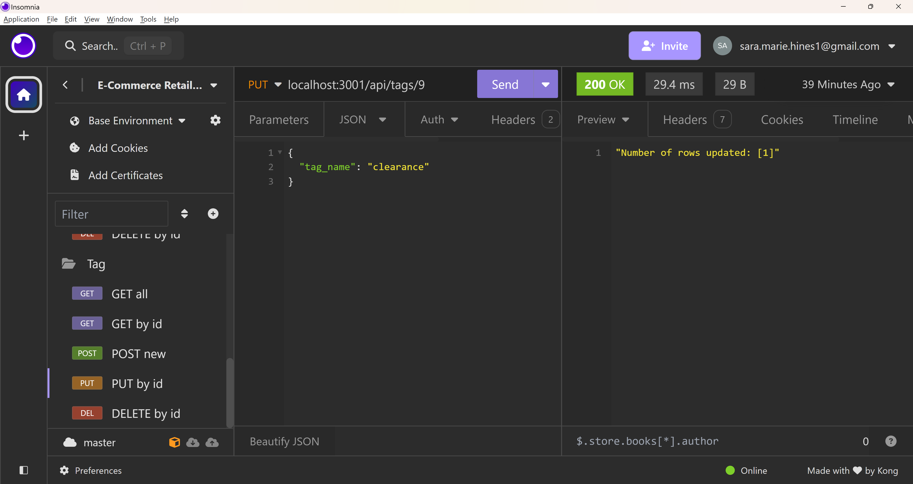

<a name="readme-top"></a>

<div align="center">
    <!-- PROJECT SHIELDS -->
    <a href="https://github.com/sara-hines/e-commerce-retail-platform/graphs/contributors" style="text-decoration: none;">
        
    </a>
    <a href="https://github.com/sara-hines/e-commerce-retail-platform/network/members" style="text-decoration: none;">
        
    </a>
    <a href="https://github.com/sara-hines/e-commerce-retail-platform/stargazers" style="text-decoration: none;">
        
    </a>
    <a href="https://github.com/sara-hines/e-commerce-retail-platform/issues" style="text-decoration: none;">
        
    </a>
    <a href="https://github.com/sara-hines/e-commerce-retail-platform/blob/master/LICENSE.txt" style="text-decoration: none;">
        
    </a>
</div>


<br />
<div align="center">

<h3 align="center">E-Commerce Retail Back-end</h3>

  <p align="center">
    An e-commerce solution for retail inventory management
    <br />
    <br />
    <a href="https://github.com/sara-hines/e-commerce-retail-platform"><strong>Explore the docs »</strong></a>
    <br />
    <br />
    <a href="https://drive.google.com/file/d/1XQoS31rJpKoXwdzyg32eu7jqf47HGa6H/view?usp=sharing">View Walkthrough Video</a>
    ·
    <a href="https://github.com/sara-hines/e-commerce-retail-platform/issues/new?labels=bug&template=bug-report---.md">Report a Bug</a>
    ·
    <a href="https://github.com/sara-hines/e-commerce-retail-platform/issues/new?labels=enhancement&template=feature-request---.md">Request a Feature</a>
  </p>
</div>

<br />
<!-- TABLE OF CONTENTS -->
<details>
  <summary>Table of Contents</summary>
  <ol>
    <li>
      <a href="#description">Description</a>
      <ul>
        <li><a href="#built-with">Built With</a></li>
      </ul>
    </li>
    <li>
      <a href="#getting-started">Getting Started</a>
      <ul>
        <li><a href="#prerequisites">Prerequisites</a></li>
        <li><a href="#installation">Installation</a></li>
      </ul>
    </li>
    <li>
      <a href="#model-relationships-reference">Model Relationships Reference</a>
    </li>
    <li>
        <a href="#usage">Usage</a>
        <ul>
            <li>
                <a href="#database-operations-for-categories">Database Operations for Categories</a>
                <ul>
                    <li><a href="#read-get-all-categories">Read (GET) All Categories</a></li>
                    <li><a href="#read-get-a-single-category">Read (GET) a Single Category</a></li>
                    <li><a href="#create-post-a-new-category">Create (POST) a New Category</a></li>
                    <li><a href="#update-put-a-category">Update (PUT) a Category</a></li>
                    <li><a href="#delete-delete-a-category">Delete (DELETE) a Category</a></li>
                </ul>
            </li>
            <li>
                <a href="#database-operations-for-products">Database Operations for Products</a>
                <ul>
                    <li><a href="#read-get-all-products">Read (GET) All Products</a></li>
                    <li><a href="#read-get-a-single-product">Read (GET) a Single Product</a></li>
                    <li><a href="#create-post-a-new-product">Create (POST) a New Product</a></li>
                    <li><a href="#update-put-a-product">Update (PUT) a Product</a></li>
                    <li><a href="#delete-delete-a-product">Delete (DELETE) a Product</a></li>
                </ul>
            </li>
            <li>
                <a href="#database-operations-for-tags">Database Operations for Tags</a>
                <ul>
                    <li><a href="#read-get-all-tags">Read (GET) All Tags</a></li>
                    <li><a href="#read-get-a-single-tag">Read (GET) a Single Tag</a></li>
                    <li><a href="#create-post-a-new-tag">Create (POST) a New Tag</a></li>
                    <li><a href="#update-put-a-tag">Update (PUT) a Tag</a></li>
                    <li><a href="#delete-delete-a-tag">Delete (DELETE) a Tag</a></li>
                </ul>
            </li>
        </ul>
    </li>
    <li><a href="#contributing">Contributing</a></li>
    <li><a href="#license">License</a></li>
    <li><a href="#contact">Contact</a></li>
    <li><a href="#acknowledgments">Acknowledgments</a></li>
  </ol>
</details>
<br />


<!-- ABOUT THE PROJECT -->
## Description

E-Commerce makes up a substantial and ever-growing portion of all commerce, and every e-commerce site needs a method for managing stock and prices. This project is a backend solution to the problem of inventory management, pulling in PostgreSQL and Sequelize for strong database management. The application facilitates Create, Read, Update, and Delete (CRUD) operations for Categories, Products, and Tags, providing a foundation for tracking and modifying inventory. The Category, Product, and Tag models have specific associations which allow data to be stored logically, without redundancy. These model relationships have been designed with the real-world needs of e-commerce companies in mind. Products can be organized and filtered by category, and additional labels (tags) can be applied to products across categories without impacting their overall categorization. (Think adding a "clearance" tag to many products across the "Shirts", "Music", and "Shoes" categories.) User-friendly, informative JSON messages are sent to help clarify the results of a HTTP request, especially for update and delete operations. In cases when errors occur, they are handled appropriately to help the user understand any unexpected results.

Feel free to read through the [Usage](#usage) section, follow along with the [walkthrough video](https://drive.google.com/file/d/1XQoS31rJpKoXwdzyg32eu7jqf47HGa6H/view?usp=sharing), or clone and run the API to learn more!

<p align="right">(<a href="#readme-top">back to top</a>)</p>


### Built With

- [![Postgres][PostgreSQL]][Postgres-url]
- [![Sequelize][Sequelize.org]][Sequelize-url]
- [![Express][Express.js]][Express-url]
- [![Node][Node.js]][Node-url]
- [![Insomnia][Insomnia.rest]][Insomnia-url]
- [![Javascript][JavaScript]][Javascript-url]
- [![Nodemon][Nodemon.io]][Nodemon-url]
- [![VSCode][Visualstudio.com]][VSCode-url]

<p align="right">(<a href="#readme-top">back to top</a>)</p>


<!-- GETTING STARTED -->
## Getting Started

First, ensure that you have the programs listed in the [Prerequisites](#prerequisites) installed on your local machine. Continue through the [Installation](#installation) steps, which will create the database, establish the connection, and start the server. Follow along with the [Usage](#usage) section or [walkthrough video](https://drive.google.com/file/d/14mfIR_051DTd24HeEsaBhJFvdu30IYW7/view?usp=sharing) to start making HTTP requests and see the API in action!

### Prerequisites

To use this API, you'll need to have Node.js and PostgreSQL installed locally. Node.js can be installed [here](https://nodejs.org/en/download) and PostgreSQL can be installed [here](https://www.postgresql.org/download/). You will use your PostgreSQL username and password as part of the installation/set-up process. You'll also need to access the PostgreSQL terminal through an extension to your code editor. For testing routes: if you don't have an API client already installed, you can download Insomnia [here](https://insomnia.rest/download) or Postman [here](https://www.postman.com/downloads/) (any API client will work).

### Installation

1. Clone the repo:
    ```sh
    git clone https://github.com/sara-hines/e-commerce-retail-platform.git
    ```

2. Navigate to the project directory:
    ```
    cd e-commerce-retail-platform
    ```

3. Install NPM packages:
    ```sh
    npm install
    ```

4. Create a .env file with the following environmental variables:
    ```sh
    DB_NAME='ecommerce_db'
    DB_USER=<your PostgreSQL username, in quotes>
    DB_PASSWORD=<your PostgreSQL password, in quotes>
    ```

5. Log in to the PostgreSQL terminal, run the schema.sql file, and exit out of the PostgreSQL terminal:
    ```sh
    psql -U <your PostgreSQL username>
    *enter your PostgreSQL password when prompted*
    \i db/schema.sql;
    \q
    ```

6. Seed the database:
    ```
    npm run seed
    ```

7. Start the application:
    ```
    npm run start
    ```
    
5. When the server is running, you will see a message in your terminal with the number of the port the server is listening on. If the port is the default, 3001, the base URI for HTTP requests will be `localhost:3001`. Throughout the [Usage](#usage) section, example URIs will be given assuming a port number of 3001; make sure to use your port number if the app is listening on a different port. 

<p align="right">(<a href="#readme-top">back to top</a>)</p>


## Model Relationships Reference


<br />
Model relationships are vital for accurately storing and tracking the data that underpins the entire e-commerce websites. Feel free to refer to the above Entity Relationship Diagram (ERD) and the model relationship descriptions to better understand how this back-end application manages e-commerce inventory. 

<br />

The Category and Product models have a one-to-many relationship, with each product belonging to a single category, and each category having many products. 

The Product and Tag models have a many-to-many relationship. Products belong to many tags through the ProductTag junction table. Likewise, tags belong to many products through the ProductTag junction table.

These relationships allow products to be organized and filtered, and allow additional labels (tags) to be added and removed from products without impacting their overall categorization. 

<!-- USAGE EXAMPLES -->
## Usage

### Database Operations for Categories

#### Read (GET) All Categories

Open the API client of your choosing and send a GET request to localhost:3001/api/categories to see all categories (based on the seed data). The response will be an array of objects starting with the category named "Shirts", id of 1. It should look like the following image:


<br />

#### Read (GET) a Single Category

To find a single category by id, send a GET request to localhost:3001/api/categories/:id using the desired category's id as the request parameter. For example, the following GET request to localhost:3001/api/categories/1 retrieves only the category with the id of 1: 


<br />

#### Create (POST) a New Category

Create a new category by sending a POST request to localhost:3001/api/categories, making sure to include the category_name in the request body. The below request creates a new category with the category_name "Jackets."


<br />

#### Update (PUT) a Category

If you need to modify an already existing category, send a PUT request to localhost:3001/api/categories/:id with the updated information in the request body. The below request changes the category_name of the previously created category (with the id of 6) from "Jackets" to "Indie Music."


<br />

#### Delete (DELETE) a Category

The final route for categories is the DELETE route, localhost:3001/api/categories/:id (where :id is the id of the category to be deleted). In the below screenshot, the "Indie Music" category with id=6 is deleted from the database.


<br />

### Database Operations for Products

#### Read (GET) All Products

A GET request to localhost:3001/api/products will fetch all products, along with their category and tag data. The below 3 screenshots show the nested structure of the array of product objects returned.


<br />

#### Read (GET) a Single Product

A GET request to localhost:3001/api/products/:id will return a single product by id. The below screenshot shows the structure of the product with id = 1, which has a product_name of "Plain T-Shirt."


<br />

#### Create (POST) a New Product

To create a new product, send a POST request to localhost:3001/api/products including the following in the JSON request body: product_name, price, stock, and any tagIds (tagIds should be an array of tag_ids representing the tags that apply to that product). 

If you provide tagIds in the request body, the response will be the array of productTagId's created from the tagIds you provided. The ProductTag model is used as a joint table that facilitates the many-to-many relationship between Product and Tag, and using this structure gives us a clean way to work with that many-to-many relationship. The below 2 screenshots show examples of (1) the POST request with the array of productTagId's as the response, and (2) the full, newly created product.


<br />

If you do not provide tagIds in the request body (you should still provide the tagIds property, but just use an empty array for the value), the response will be the newly created product itself—see the below screenshot for an example. 


<br />

#### Update (PUT) a Product

To update a product, send a PUT request to localhost:3001/api/products/:id, including the values for product_name, price, stock, and tagIds which you'd like the updated product to have. The response will be a number of rows updated. 


<br />

#### Delete (DELETE) a Product

Deleting a product requires only the id of the product to be deleted, used as a request parameter in the URI endpoint (send requests to localhost:3001/api/products/:id). The below screenshot shows a successful deletion of the product with the id of 6. The response is the number of rows deleted.


<br />

### Database Operations for Tags

#### Read (GET) All Tags

Send a GET request to localhost:3001/api/tags to view all tags. The below screenshot shows the full structure of the first tag which appears (the tag with the id of 1).


<br />

#### Read (GET) a Single Tag

GET a single tag by id by sending a GET request to localhost:3001/api/tags/:id. In the below screenshot, the id of 1 in the request parameter retrieved the tag with the id of 1. 


<br />

#### Create (POST) a New Tag

Creating a new tag is simple—just send a POST request to localhost:3001/api/tags, including the tag_name in the request body, similar to the below screenshot: 


<br />

#### Update (PUT) a Tag

To update a tag, send a PUT request to localhost:3001/api/tags/:id while including the new tag_name in the request body. In the below screenshot, the previously created tag with the tag_name of "on sale" is changed to have a tag_name of "clearance."



<br />

#### Delete (DELETE) a Tag

To delete a tag, send a DELETE request to localhost:3001/api/tags/:id, where the id request parameter is the id of the tag to be deleted. 


<br />

<p align="right">(<a href="#readme-top">back to top</a>)</p>


<!-- CONTRIBUTING -->
## Contributing

Contributions are what make the open source community such an amazing place to learn, inspire, and create. Any contributions you make are **greatly appreciated**.

If you have a suggestion that would make this better, please fork the repo and create a pull request. You can also simply open an issue with the tag "enhancement".

Don't forget to give the project a star! Thanks again!

1. Fork the Project
2. Create your Feature Branch (`git checkout -b feature/AmazingFeature`)
3. Commit your Changes (`git commit -m 'Add some AmazingFeature'`)
4. Push to the Branch (`git push origin feature/AmazingFeature`)
5. Open a Pull Request

<p align="right">(<a href="#readme-top">back to top</a>)</p>


<!-- LICENSE -->
## License

This project is covered under the MIT License. You can learn more about this license and its coverage and permissions [here](https://opensource.org/licenses/MIT).

<p align="right">(<a href="#readme-top">back to top</a>)</p>


<!-- CONTACT INFO -->
## Contact

If you have any questions/thoughts about this project or would like to connect, you can reach me at https://github.com/sara-hines/ or sara.marie.hines1@gmail.com. I look forward to hearing from you!

<p align="right">(<a href="#readme-top">back to top</a>)</p>


<!-- ACKNOWLEDGMENTS -->
## Acknowledgments

I used [dbdiagram.io](https://dbdiagram.io/home) to create the Entity Relationship Diagram for the Model Relationships Reference. Thank you to dbdiagram.io for making this wonderful tool available for the data community!

This README was made from a modified template created by [@othneildrew](https://github.com/othneildrew). View the original [here](https://github.com/othneildrew/Best-README-Template).

C, Z. (2017, May 24). Using returning with sequelize and Postgres - Zach C. Medium. https://medium.com/@zachcaceres/using-returning-with-sequelize-and-postgres-68fa88212d06 (Used to confirm that the destroy() method returns a number of rows deleted.)

Stack Overflow. (2024, April 26). When should I use try catch instead of then catch? Stack Overflow. https://stackoverflow.com/questions/69362121 when-should-i-use-try-catch-instead-of-then-catch (Used for general planning of when to use try catch versus .then().)

<p align="right">(<a href="#readme-top">back to top</a>)</p>


<!-- MARKDOWN LINKS -->

[PostgreSQL]:https://img.shields.io/badge/postgres-%23316192.svg?style=for-the-badge&logo=postgresql&logoColor=white
[Postgres-url]: https://www.postgresql.org/
[Sequelize.org]: https://img.shields.io/badge/Sequelize-52B0E7?style=for-the-badge&logo=Sequelize&logoColor=white
[Sequelize-url]: https://sequelize.org/
[Express.js]: https://img.shields.io/badge/express.js-%23404d59.svg?style=for-the-badge&logo=express&logoColor=%2361DAFB
[Express-url]: https://expressjs.com/
[Node.js]: https://img.shields.io/badge/node.js-6DA55F?style=for-the-badge&logo=node.js&logoColor=white
[Node-url]: https://nodejs.org
[Insomnia.rest]: https://img.shields.io/badge/Insomnia-black?style=for-the-badge&logo=insomnia&logoColor=5849BE
[Insomnia-url]: https://insomnia.rest/
[JavaScript]: https://img.shields.io/badge/javascript-%23323330.svg?style=for-the-badge&logo=javascript&logoColor=%23F7DF1E
[Javascript-url]: https://ecma-international.org/publications-and-standards/standards/ecma-262/
[Nodemon.io]: https://img.shields.io/badge/NODEMON-%23323330.svg?style=for-the-badge&logo=nodemon&logoColor=%BBDEAD
[Nodemon-url]: https://nodemon.io/
[Visualstudio.com]: https://img.shields.io/badge/Visual%20Studio%20Code-0078d7.svg?style=for-the-badge&logo=visual-studio-code&logoColor=white
[VSCode-url]: https://code.visualstudio.com/